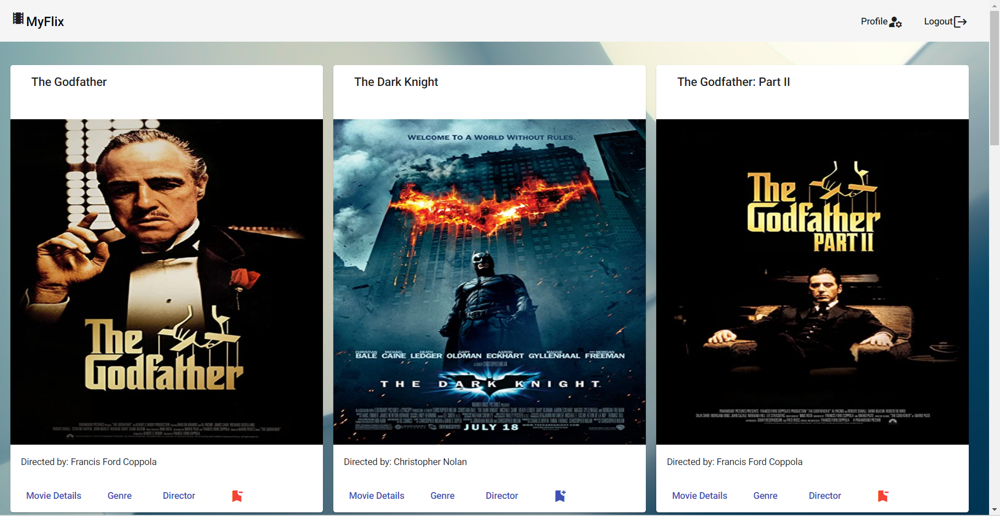

# MovieApiAngularClient

This project was generated with [Angular CLI](https://github.com/angular/angular-cli) version 13.2.3.

---

# Objective:

**Using Angular, build the client-side for an application called MovieFlix based on its existing server-side code (REST API and database, with supporting documentation.**

---

# Design Criteria:

## User Stories:

- As a user, I want to be able to receive information on movies, directors, and genres so that I can learn more about movies I’ve watched or am interested in.
- As a user, I want to be able to create a profile so I can save data about my favorite movies.

## Key Features:

- Your app should display a welcome view where users will be able to either log in or register an account.
- Once authenticated, the user should now view all movies.
- Upon clicking on a particular movie, users will be taken to a single movie view, where additional movie details will be displayed. The single movie view will contain the following additional features: 
  - A button that when clicked takes a user to the director view, where details about the director of that particular movie will be displayed.
  - A button that when clicked takes a user to the genre view, where details about that particular genre of the movie will be displayed.

## Technical Requirements:

- The application must be written in Angular (version 9 or later)
- The application requires the latest version of Node.js and npm package
- The application must contain user registration and login forms
- The application must be designed using Angular Material
- The application's codebase must contain comments using Typedoc
- The project must contain technical documentation using JSDoc
- The project must be hosted on GitHub Pages

---

# Setup:

## Development server:

Run `ng serve` for a dev server. Navigate to `http://localhost:4200/`. The app will automatically reload if you change any of the source files.

## Code scaffolding:

Run `ng generate component component-name` to generate a new component. You can also use `ng generate directive|pipe|service|class|guard|interface|enum|module`.

## Build:

Run `ng build` to build the project. The build artifacts will be stored in the `dist/` directory.

## Running unit tests:

Run `ng test` to execute the unit tests via [Karma](https://karma-runner.github.io).

## Running end-to-end tests:

Run `ng e2e` to execute the end-to-end tests via a platform of your choice. To use this command, you need to first add a package that implements end-to-end testing capabilities.

## Further help:

To get more help on the Angular CLI use `ng help` or go check out the [Angular CLI Overview and Command Reference](https://angular.io/cli) page.

---

# Other Setups and Installation requirements:

1. Check if Angular is installed: 
   run `ng --version` in the Terminal 

- If Angular is installed, make sure you have the latest version: 
  run `npm install -g @angular/cli@latest` in the Terminal 

- If Angular is not installed, install the latest version: 
  run `npm install -g @angular/cli` in the Terminal 
  _Until recently, @angular/cli was known as angular-cli. Keep this in mind when looking at web-based resources as some may be outdated._

2. Before starting a new project, make sure Node.js and npm package manager are up to date. 
   run `node -v` and `npm -v` in the Terminal to check the installed version.

3. Start an new Angular project: 
   run `ng new <reposetory/project-name>` in the Terminal 
   _The CLI tool will ask you about adding routes (at this point, the answer is Yes) and what type of stylesheets you want to use (SCSS is a good choice)._

4. Material Design is a popular visual language that Google developed back in 2014. It uses classic principles of good design to build systems that allow for a unified experience across different environments. 
   A version of Material Design, called Angular Material, is used as a UI component library in Angular. It offers a number of components that are a good fit for this app.  
   To get started with Angular Material, you’ll need to install it as a project dependency using your Angular CLI: 
   run `ng add @angular/material` in the Terminal and follow this steps: 

   - First, choose "Custom" to select a custom theme, then type "Yes" and hit Enter to set up Angular typography styles and browser animations for Angular Material
   - Next, add the modules from the Material components you'll be using in your project. In order to use the Material modules in your component, it needs to be registered in the app.module.ts file - Next, you need to add these modules in the imports array of your main module

5. Use @angular/cli to create new components: 
   run `ng generate component <component-name>` in the Terminal

6. Deploying the Application: 
   At frist you need to add angular-cli-ghpages by running `ng add angular-cli-ghpages`

7. Build your application, to do so, run the following command, replacing <repository-name> with your own repository name: 
   `ng deploy --base-href=/<repository-name>/`

8. Wait for angular-cli-ghpages to generate the new production code. It will then try to push the code to the gh-pages branch, so it will prompt you to enter your GitHub username and password if you haven't automated the GitHub authentication process before.

---

# App / Livepage:

[Link to Livepage](https://marcel-patrick.github.io/movie_api-Angular-client/welcome)

Livepage after successfully log-in:

